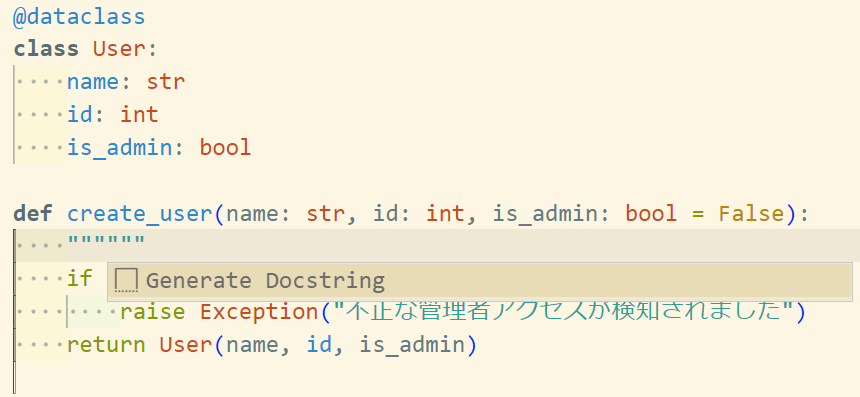
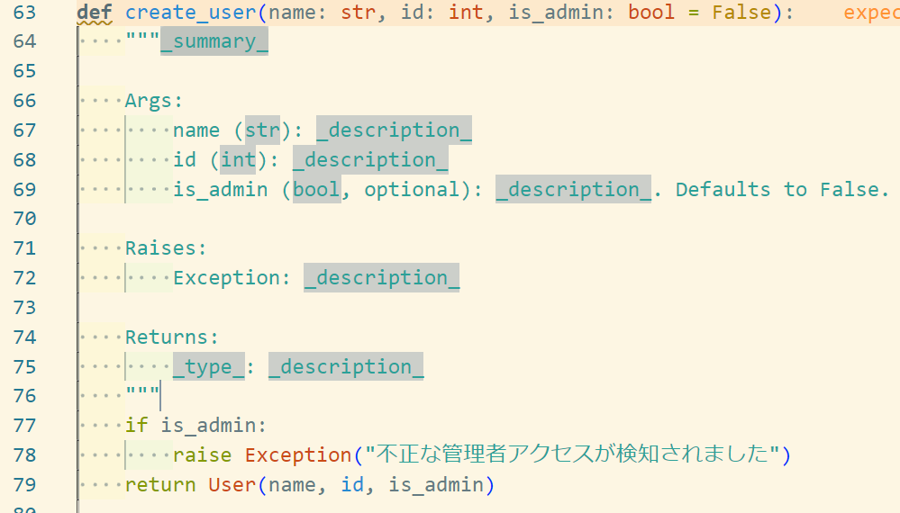

# コメントについて
Python Docstringについて。

## Python Docstring とは

> Pythonにおけるクラスや、メソッド(関数)についての説明を記載したコメント文のこと。
>
> Docstringは、__doc__という変数に格納されている。
>
> 以下は、printメソッドのDocstringを表示させたもの。
>
> ```
> >>> print(print.__doc__)
> print(value, ..., sep=' ', end='\n', file=sys.stdout, > flush=False)
>
> Prints the values to a stream, or to sys.stdout by > default.
> Optional keyword arguments:
> file:  a file-like object (stream); defaults to the > current sys.stdout.
> sep:   string inserted between values, default a space.
> end:   string appended after the last value, default a > newline.
> flush: whether to forcibly flush the stream.
> ```
>
> 自作したクラスや、メソッドにDocstringを記載しておくと、
> **IDE上に補足情報として表示させることや、Sphinxを使用して、ソースコードの仕様書を自動作成することが可能に**なる。
> [GoogleスタイルのPython Docstringの入門 - Qiita](https://qiita.com/11ohina017/items/118b3b42b612e527dc1d#python-docstring%E3%81%A8%E3%81%AF)

### 記法

Docstringの記法には、reStructuredTextスタイル，Numpyスタイル，Googleスタイルの3つがある。

### メリット
- 統一したフォーマットでコメントを残しておくことで、コードの使いまわし・引き継ぎが容易になる
- IDE上に補足情報として表示されるため、便利
- ソースコードの仕様書を自動作成することが可能

## Sphinxとは

> Sphinxは、reStructuredTextという形式で記載されたテキストをHTML、PDFやepubなどの様々な形式へ変換することができるOSSのドキュメント生成ツール。
>
> Pythonの公式ドキュメントはSphinxを使って書かれている。
>
> Sphinxを用いると、Pythonのソースコード上からPython Docstringのコメント文を抽出して、ソースコード仕様書を自動生成することが可能。

> Sphixを使用した、Docstringの活用方法は下記を参照。
> https://qiita.com/futakuchi0117/items/4d3997c1ca1323259844
> [GoogleスタイルのPython Docstringの入門 - Qiita](https://qiita.com/11ohina017/items/118b3b42b612e527dc1d#sphinx%E3%81%A8%E3%81%AF)

## サンプルコード

```python
"""モジュールの説明タイトル

* ソースコードの一番始めに記載すること
* importより前に記載する
"""
import json
import inspect

class testClass() :
    """クラスの説明タイトル

    クラスについての説明文

    Attributes:
        属性の名前 (属性の型): 属性の説明
        属性の名前 (:obj:`属性の型`): 属性の説明.

    """

    def print_test(self, param1, param2) :
        """関数の説明タイトル

        関数についての説明文

        Args:
            引数の名前 (引数の型): 引数の説明
            引数の名前 (:obj:`引数の型`, optional): 引数の説明.

        Returns:
            戻り値の型: 戻り値の説明 (例 : True なら成功, False なら失敗.)

        Raises:
            例外の名前: 例外の説明 (例 : 引数が指定されていない場合に発生 )

        Yields:
            戻り値の型: 戻り値についての説明

        Examples:

            関数の使い方について記載

            >>> print_test ("test", "message")
               test message

        Note:
            注意事項などを記載

        """
        print("%s %s" % (param1, param2) )

if __name__ == '__main__':

    test_object = testClass()
    test_object.print_test("test", "message")
```

### 書き方

- docstringをコメントブロック `"""` で囲む
- `"""` の隣にタイトルを記載
- モジュール、クラス、関数が対象

## コメントテンプレート挿入を自動化する
VSCodeの**autoDocstring**という拡張機能を使用する。

`"""` を入力すると、次のような表示が出てくる。


実行すると、下のようにコメントのテンプレートが挿入される。


導入方法: [docstringのテンプレートを出力してくれるautoDocstringのVS Code拡張が素敵だった - Qiita](https://qiita.com/simonritchie/items/870be09620b9df652bf6)
