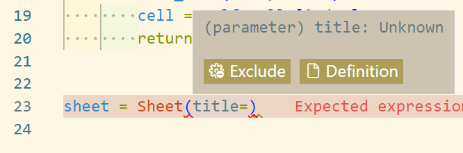
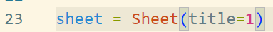
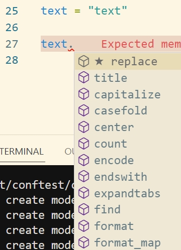
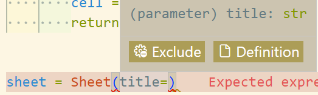
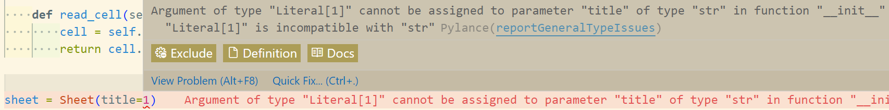
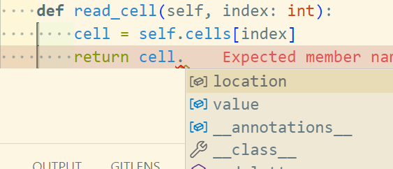

# Pythonにおける型付け
## 環境など
出来れば Python 3.10, 少なくとも Python 3.7から3.9 を推奨。

この文書では Python3.10 を前提とする。

Python3.10 以前のバージョンでもtypingモジュールなどを別途 `import` すれば下で紹介するすべての機能を利用出来るが、Python3.10以降が一番楽。

## 動的型付け言語
Pythonは動的型付け言語。

厳密な定義を書くと長くなるので雑にまとめると、コードを書く時に型を(あまり)気にする必要がないのが動的型付け言語、型を気にして書かなければいけないのが静的型付け言語。
前者はPythonやPHPなど、後者はC系の言語やDelphiなどが該当する。

> ※ 静的型付け言語であってもRTTIと呼ばれる手法により動的型を扱えるようにしている言語や、インタープリターを主とした言語であっても予め型情報を定義出来る言語がある。
> つまり、動的型付け・静的型付けのどちらも扱える場合もある。

## IDEと動的型付け言語の相性

前述の通りPythonは動的型付け言語なので、基本的に型を意識する必要がない。

しかし、動的型付け言語はVSCodeなどのIDEで型の補完・サジェストがあまり効かない。

そのため、どんなデータ型が渡されているのか見に行ったり、推測したりする必要があり、それが開発効率に影響する。

### 例: 型指定無し

下のサンプルコードを利用する。Excelファイルの要素をPythonのクラスとして擬似的に表したもの。

```python
class Cell:
    """疑似Excelセル
    型無
    """
    def __init__(self, location, value):
        self.location = location
        self.value = value


class Sheet:
    """疑似Excelシート
    型無
    """
    def __init__(self, title):
        self.title = title
        self.cells = []

    def read_cell(self, index):
        cell = self.cells[index]
        return cell.value
```

まず、`Sheet`クラスのインスタンスを作ってみる。

```python
sheet = Sheet("title")
```

引数`title`の型を指定していないので、当然ながらサジェストは出ない。(型情報がUnknownになっている)



また、ここでは引数として文字列を期待しているが、整数型を渡されたとしても、特に警告は出ない。



次に、`read_cell`関数の中を見ていく。

```python
class Sheet:
    ︙
    def read_cell(self, index):
        cell = self.cells[index]
        return cell.value
```

型を指定していないため、`cell` の後に `.` を打っても何もサジェストされない。ここでは`value`というインスタンス変数にアクセスしているが、その変数が実際に存在しているという保証は無い。


※ VSCodeでは型が明確になっている場合、下のようなサジェストが出る。



### 例: 型指定有り
前述のように、型が明確になっていないと様々な問題が発生する。
そこで、型を指定してみる。

先程のコードに型指定を追加すると下のようになる。(書き方は後述)

```python
class Cell:
    """疑似Excelセル
    型有
    """
    # str | int => str または int
    def __init__(self, location: str, value: str | int) -> None:
        self.location = location
        self.value = value


class Sheet:
    """疑似Excelシート
    型有
    """
    def __init__(self, title: str) -> None:
        self.title = title
        self.cells: list[Cell] = []

    def read_cell(self, index: int) -> str | int:
        cell = self.cells[index]
        return cell.value
```

まず、`Sheet`クラスのインスタンスを作ってみる。

```python
sheet = Sheet("title")
```

型がサジェストされるようになっている。


また、整数型を渡すと警告が出る。


次に、`read_cell`関数の中を見ていく。

```python
class Sheet:
    ︙
    def read_cell(self, index: int):
        cell = self.cells[index]
        return cell.value
```

※ `self.cells: list[Cell] = []` により、 「`self.cells` は `Cell` 型のリストである」と指定されている。


型の指定により、`cell` の後に `.` を打つとメソッドなどがサジェストされるようになった。

このように、Pythonでコードを書く際も型ヒントを書くようにするとIEDが期待通りの動作をするようになり、便利。

## 書き方
### 基本
#### 変数

`変数名: 型` のように記述する。

```python
number: int = 1
text: str = "hello"

fruits: list[str] = ["apple", "banana", "lemon"]
address: dict[str, str] = {
    "user1": "xxx県 xxx市 xxx町",
    "user2": "zzz県 zzz市 zzz町",
}
```

変数の宣言時にそのまま値を代入するような場合 (`number = 1`, `instance = Class()` など) はそのままでも補完が効くため、あまりうまみが無い。

真価を発揮するのは後になって代入するときや、配列を初期化しておいて後で値を入れるような場合。

```python
value: int
names: list[str] = []
︙
value = 1000
names.append("name")
```

#### 関数

引数は変数と同様。返り値は `def func() -> 返り値の型` のように記述する。

```python
def hello(name: str) -> None:
    print(f"Hello, {name}!")


def multiple(number: int) -> int:
    return number * 2
```

何も返さない場合は `None` を指定する。

#### クラス

関数と変数の型をそれぞれ指定するだけ。

```python
class Cell:
    """疑似Excelセル
    """
    def __init__(self, location: str, value: str | int) -> None:
        self.location = location
        self.value = value


class Sheet:
    """疑似Excelシート
    """
    def __init__(self, title: str) -> None:
        self.title = title
        self.cells: list[Cell] = []

    def read_cell(self, index: int) -> str | int:
        cell = self.cells[index]
        return cell.value
```

クラスは設計図のようなものなので、どこにどんな値が入るのか実装時には確定していないことが多い。そのため、型指定の恩恵を受けやすい。

#### Union / オプショナル

```python
# OR条件
year: int | str

# オプショナル
from typing import Optional

age: Optional[int]
```

### 発展
#### 型エイリアス

`Cell.value` と `Sheet.read_cell` の返り値の型は同じ `str | int` である。

```python
class Cell:
    """疑似Excelセル
    """
    def __init__(self, location: str, value: str | int) -> None:
        self.location = location
        self.value = value


class Sheet:
    """疑似Excelシート
    """
    def __init__(self, title: str) -> None:
        self.title = title
        self.cells: list[Cell] = []

    def read_cell(self, index: int) -> str | int:
        cell = self.cells[index]
        return cell.value
```

この `str | int` という型は `Cell.value` の型を表しているが、このままでは使い回す際に不便。また、何を表すか不明瞭。

そこで、型エイリアスを使う。

```python
ValueType: TypeAlias = int | str
```

`ValueType` という変数に型としての役割を持たせたものだと思えば良い。
これを使って先ほどのクラスを書き直すと以下のようになる。

```python
ValueType: TypeAlias = int | str


class Cell:
    """疑似Excelセル
    """
    def __init__(self, location: str, value: ValueType) -> None:
        self.location = location
        self.value = value


class Sheet:
    """疑似Excelシート
    """
    def __init__(self, title: str) -> None:
        self.title = title
        self.cells: list[Cell] = []

    def read_cell(self, index: int) -> ValueType:
        cell = self.cells[index]
        return cell.value
```

#### リテラル

型指定よりも厳しく、特定の値のみ許容する場合に使う。

```python
Direction = Literal["row", "column"]
```

#### dataclass

データを保持するためのクラスを簡単に定義出来る機能。

```python
from dataclasses import dataclass


@dataclass
class User:
    name: str
    id: int

user = User(name="username", id=1000)
```

辞書やタプルなどのデータコンテナと比較すると、dataclassには以下のようなメリットがある。

- 型の明示が可能
- イミュータブル化が簡単
- デフォルト値を設定出来る
- キーが固定されている。また、ドットアクセス出来る。(書きやすい)
