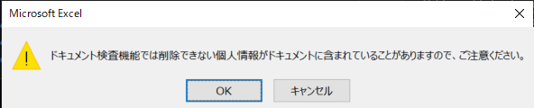

# PythonからExcelVBAを追加・実行する

## 最終的な実装

最終的なコードは以下です。

```py
import pathlib
import re

import pythoncom
import win32com.client

# ex: Sub FooBar()
REGEX_MACRO_LINE = re.compile(r"Sub \S+\(\)")
# `Sub ` or `()` にマッチ
REGEX_MACRO_NAME = re.compile(r"Sub |\(\)")


def relative_to_abs(path: str) -> str:
    """相対パスを絶対パスに変換する。(相対パスだと pywin32 でエラーが出るため)

    Args:
        path (str): 変換前のファイルパス。

    Returns:
        str: 絶対パスに変換したファイルパス。
    """
    return str(pathlib.Path(path).resolve())


def get_macro_names_from_code(macro_code: str) -> list[str] | None:
    """マクロのコードからマクロ名の一覧を取得する。

    Args:
        macro_code (str): マクロのコード。

    Returns:
        list[str] | None: マクロ名の一覧。
    """
    macro_names: list[str] = []
    # ex: ["Sub Foo()", "Sub Bar()"]
    macro_name_lines: list[str] = REGEX_MACRO_LINE.findall(macro_code)

    if not macro_name_lines:
        return

    # ex: ["Foo", "Bar"]
    [macro_names.append(REGEX_MACRO_NAME.sub("", line)) for line in macro_name_lines]
    return macro_names


def add_macro(filepath: str, macro_code: str, is_visible: bool = True) -> None:
    """Excelファイルにマクロを追加する。
    NOTE: 定義先は ThisWorkbook とするため、`VBProject.VBComponents(1)`にアクセスする。

    Args:
        filepath (str): Excelファイルのパス。(絶対パス)
        macro_code (str): 追加したいマクロのコード。
        is_visible (bool, optional): 操作中のExcelを表示するかどうか。デフォルトは `True` 。
    """
    xl = win32com.client.Dispatch("Excel.Application")
    xl.Visible = is_visible
    wb = xl.Workbooks.Open(filepath)

    macro_names = get_macro_names_from_code(macro_code)
    try:
        macro_name = macro_names[0]
    # 存在しなかった場合 None を返すので TypeError をキャッチ
    except TypeError:
        print(f"マクロから名前を取得出来ませんでした {macro_code}")
        return

    code_module = wb.VBProject.VBComponents(1).CodeModule
    existing_macro_code = code_module.Lines(1, code_module.CountOfLines)
    existing_macro_names = get_macro_names_from_code(existing_macro_code)

    # 同名のマクロが存在する場合 return
    if existing_macro_names:
        if macro_name in existing_macro_names:
            print(f"{macro_name} という名前のマクロは既に存在します")
            return

    try:
        wb.VBProject.VBComponents(1).CodeModule.AddFromString(macro_code)
        wb.Save()
    except pythoncom.com_error as e:
        print(e.excepinfo[2])
        print(
            """\
以下の手順により解決する可能性があります。
    1. 「ファイル」タブを選択
    2. 「オプション」を選択
    3. 「セキュリティ センター」を選択
    4. 「セキュリティ センターの設定」を選択
    5. 「マクロの設定」 を選択
    6. 「VBA プロジェクト オブジェクト モデルへのアクセスを信頼する」のチェックボックスをオンにする
"""
        )
    finally:
        wb.Close(True)
        xl.Quit()


def exec_macro(filepath: str, macro_name: str, is_visible: bool = True) -> None:
    """Excelファイルのマクロを実行する。

    Args:
        filepath (str): Excelファイルのパス。(絶対パス)
        macro_name (str): マクロの名前。
        is_visible (bool, optional): 操作中のExcelを表示するかどうか。デフォルトは `True` 。
    """
    xl = win32com.client.Dispatch("Excel.Application")
    xl.Visible = is_visible
    wb = xl.Workbooks.Open(filepath)

    xl.Application.Run(macro_name)
    wb.Save()
    wb.Close()
    xl.Application.Quit()


def to_xlsm_if_xlsx(filepath: str) -> None:
    """拡張子が `.xlsx` だった場合、 `xlsm` に変換する。

    Args:
        filepath (str): Excelファイルのパス。
    """
    path = pathlib.Path(filepath)
    if path.suffix == ".xlsx":
        xlsm_filepath = str(path.with_suffix(".xlsm").resolve())

        xl = win32com.client.Dispatch("Excel.Application")
        wb = xl.Workbooks.Open(filepath)
        wb.SaveAs(xlsm_filepath, FileFormat=win32com.client.constants.xlOpenXMLWorkbookMacroEnabled)
        xl.Quit()


sheet_index = 1
xlsx_path = relative_to_abs("./tests/test.xlsx")
xlsm_path = relative_to_abs("./tests/test.xlsm")

# ThisWorkbook に定義する前提なので `ThisWorkbook.MacroName` とする
macro_name = "ThisWorkbook.CopySheet"
シートをコピーするマクロの例
macro_code = f"""\
Sub CopySheet()
    Worksheets({str(sheet_index)}).Copy After:=Worksheets(Sheets.Count)
    ActiveSheet.Name = Format(Now, "YYYY-MM-DD HH-MM-SS")
End Sub"""

to_xlsm_if_xlsx(xlsx_path)
add_macro(xlsm_path, macro_code)
exec_macro(xlsm_path, macro_name)
```

## 背景

TODO 書く

## やったこと

### 準備

`pip` かお好きなパッケージ管理ツールで `pywin32` を導入します。

私は pipenv を使用しています。

```shell
pip install pywin32
```

### Python からマクロを実行

参考 : [Python – openpyxlでエクセルグラフや図形が消える問題の解決法](https://miya-mitsu.com/python-openpyxl-excel-graph-image-textbox/)

```py
import win32com.client

def exec_macro(filepath: str, macro_name: str, is_visible: bool = True) -> None:
    """Excelファイルのマクロを実行する。

    Args:
        filepath (str): Excelファイルのパス。(絶対パス)
        macro_name (str): マクロの名前。
        is_visible (bool, optional): 操作中のExcelを表示するかどうか。デフォルトは `True` 。
    """
    xl = win32com.client.Dispatch("Excel.Application")
    xl.Visible = is_visible

    wb = xl.Workbooks.Open(filepath)

    xl.Application.Run(macro_name)
    wb.Save()
    wb.Close()
    xl.Application.Quit()
```

### Python によりマクロを登録

マクロがあればコピー出来るとは言っても、フォーマットExcel全てにマクロを搭載するのは面倒です。

同僚に使ってもらおうと思っても、「このマクロを登録してから使ってね！」と言うだけで使用率激減間違いなしです。
そこで、マクロの登録すらも Python から行うことにしました。

#### 既存マクロ名の取得

既に同名のマクロが存在する場合は追加しないようにしたいです。そこで、マクロ名の一覧を取得出来るようにします。

マクロのコードは `CodeModule` から取得することが出来ます。

`Sub MacroName()` から `MacroName` のみを抽出するようにしています。

参考

[how to list all Excel Macro Names using Python - Stack Overflow](https://stackoverflow.com/questions/18589877/how-to-list-all-excel-macro-names-using-python)

[CodeModuleクラス – VBE(Visual Basic Editor)](https://vbe.office-vba.com/codemodule/)

```py
import re
import win32com.client

# ex: Sub FooBar()
REGEX_MACRO_LINE = re.compile(r"Sub \S+\(\)")
# `Sub ` or `()` にマッチ
REGEX_MACRO_NAME = re.compile(r"Sub |\(\)")

def get_macro_names_from_code(macro_code: str) -> list[str] | None:
    """マクロのコードからマクロ名の一覧を取得する。

    Args:
        macro_code (str): マクロのコード。

    Returns:
        list[str] | None: マクロ名の一覧。
    """
    macro_names: list[str] = []
    # ex: ["Sub Foo()", "Sub Bar()"]
    macro_name_lines: list[str] = REGEX_MACRO_LINE.findall(macro_code)

    if not macro_name_lines:
        return

    # ex: ["Foo", "Bar"]
    [macro_names.append(REGEX_MACRO_NAME.sub("", line)) for line in macro_name_lines]
    return macro_names

# CodeModule にアクセス
# NOTE: VBComponents(1) は `ThisWorkbook` を表す
code_module = wb.VBProject.VBComponents(1).CodeModule
existing_macro_code = code_module.Lines(1, code_module.CountOfLines)
existing_macro_names = get_macro_names_from_code(existing_macro_code)

print(existing_macro_code)
# Sub CopySheet()
#     Worksheets(1).Copy After:=Worksheets(Sheets.Count)
#     ActiveSheet.Name = Format(Now, "YYYY-MM-DD HH-MM-SS")
# End Sub

print(existing_macro_names)
# CopySheet
```

#### マクロの登録

マクロの定義先は `ThisWorkbook` で固定にしています。
同名のマクロが存在する場合、処理を中断するようにしています。

参考 : [Python Add Macro to an existing XLSM - Stack Overflow](https://stackoverflow.com/questions/67194521/python-add-macro-to-an-existing-xlsm)

```py
import win32com.client

def add_macro(filepath: str, macro_code: str, is_visible: bool = True) -> None:
    """Excelファイルにマクロを追加する。
    # NOTE: 定義先は ThisWorkbook とするため、`VBProject.VBComponents(1)`にアクセスする。

    Args:
        filepath (str): Excelファイルのパス。
        macro_code (str): 追加したいマクロのコード。
        is_visible (bool, optional): 操作中のExcelを表示するかどうか。デフォルトは `True` 。
    """
    xl = win32com.client.Dispatch("Excel.Application")
    xl.Visible = is_visible
    wb = xl.Workbooks.Open(filepath)

    macro_names = get_macro_names_from_code(macro_code)
    try:
        macro_name = macro_names[0]
    # 存在しなかった場合 None を返すので TypeError をキャッチ
    except TypeError:
        print(f"マクロから名前を取得出来ませんでした {macro_code}")
        return

    code_module = wb.VBProject.VBComponents(1).CodeModule
    existing_macro_code = code_module.Lines(1, code_module.CountOfLines)
    existing_macro_names = get_macro_names_from_code(existing_macro_code)
    # 同名のマクロが存在する場合 return
    if existing_macro_names:
        if macro_name in existing_macro_names:
            print(f"{macro_name} という名前のマクロは既に存在します")
            return

    try:
        wb.VBProject.VBComponents(1).CodeModule.AddFromString(macro_code)
        wb.Save()
    except pythoncom.com_error as e:
        print(e.excepinfo[2])
        print(
            """\
以下の手順により解決する可能性があります。
    1. 「ファイル」タブを選択
    2. 「オプション」を選択
    3. 「セキュリティ センター」を選択
    4. 「セキュリティ センターの設定」を選択
    5. 「マクロの設定」 を選択
    6. 「VBA プロジェクト オブジェクト モデルへのアクセスを信頼する」のチェックボックスをオンにする
"""
        )
    finally:
        wb.Close(True)
        xl.Quit()
```

#### エラー1004 が出る場合

参考 : [実行時エラー'1004' プログラミングによる Visual Basic プロジェクトのアクセスは信頼性に欠けます のexcel2016での解決方法 - Qiita](https://qiita.com/moitaro/items/03cf067afd5da02b876c)

私の環境では「VBAプロジェクトオブジェクトモデルへのアクセスを信頼する」という設定が ON になっていないとエラーが出ました。

展開するときは注意が必要そうです。

**設定変更手順**

1. 「ファイル」タブを選択
2. 「オプション」を選択
3. 「セキュリティ センター」を選択
4. 「セキュリティ センターの設定」を選択
5. 「マクロの設定」 を選択
6. 「VBA プロジェクト オブジェクト モデルへのアクセスを信頼する」のチェックボックスをオンにする

### その他

#### `isVisible`

Excelファイルを閉じる時、環境によっては保存時に「ドキュメント検査機能が～」というダイアログが出ることがあります。



`win32com.client.Dispatch("Excel.Application")` の返り値に対して `isVisible` を `False` に設定していると、ダイアログを閉じることが出来ずにいつまでも処理が終わらない・・・という現象が起きることがあるので、注意が必要です。

#### pywin32 のエラーハンドリング

エラーハンドリングしたい場合、 `pythoncom.com_error` をキャッチします。

参考 : [python - Is there a way to decode numerical COM error-codes in pywin32 - Stack Overflow](https://stackoverflow.com/questions/521759/is-there-a-way-to-decode-numerical-com-error-codes-in-pywin32)

```py
import pythoncom


try:
    # 何らかの処理
except pythoncom.com_error as e:
        print(e.excepinfo[2])
```

#### 相対パスを絶対パスに変換

pywin32 は相対パスを受け付けないので、絶対パスに変換しておく必要があります。

```py
import pathlib

def relative_to_abs(path: str) -> str:
    """相対パスを絶対パスに変換する。(相対パスだと pywin32 でエラーが出るため)

    Args:
        path (str): 変換前のファイルパス。

    Returns:
        str: 絶対パスに変換したファイルパス。
    """
    return str(pathlib.Path(path).resolve())
```

#### `.xlsx` を `.xlsm` に変換

元となるファイルが `.xlsx` の場合はマクロ対応形式に変換したいので、その処理も追加します。

参考: [python - Pywin32 Saving as XLSM file instead of XLSX - Stack Overflow](https://stackoverflow.com/questions/21306275/pywin32-saving-as-xlsm-file-instead-of-xlsx)

```py
import pathlib

def to_xlsm_if_xlsx(filepath: str) -> None:
    """拡張子が `.xlsx` だった場合、 `xlsm` に変換する。

    Args:
        filepath (str): Excelファイルのパス。(絶対パス)
    """
    path = pathlib.Path(filepath)
    if path.suffix == ".xlsx":
        xlsm_filepath = str(path.with_suffix(".xlsm").resolve())

        xl = win32com.client.Dispatch("Excel.Application")
        wb = xl.Workbooks.Open(filepath)
        wb.SaveAs(xlsm_filepath, FileFormat=win32com.client.constants.xlOpenXMLWorkbookMacroEnabled)
        xl.Quit()
```

## 最後に

Windows や VBA 周りの仕様にはあまり詳しくないので、記載した情報の中に誤りがあるかもしれません。
もしも間違いがあれば、ご指摘いただけると幸いです。
